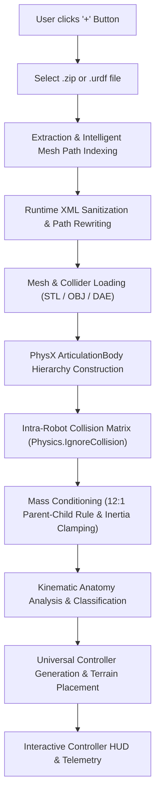

# Autonomous Robot Runtime Kit: Architecture, Physics & Kinematics Engine

> **Universal Runtime URDF/ZIP Robot Importer, Kinematic Anatomy Auto-Configurator, Multi-Modal Physics Stabilizer & Drivetrain Controller for Unity PhysX.**

---

## 1. System Overview

The **Autonomous Robot Runtime Kit** is a self-contained, standalone Unity subsystem that enables drag-and-drop or runtime file selection (`.zip`, `.urdf`) of arbitrary robot models. Once loaded, the system automatically analyzes the robot's physical anatomy, conditions its ArticulationBody hierarchy against PhysX numerical instability, generates calibrated physics materials, and attaches real-time drivetrain controllers:
- **Pure Wheeled Rovers** (Clearpath Husky, Curiosity, Perseverance, 4WD/6WD/8WD) receive **Skid-Steer & Ackermann Knuckle Steering**.
- **Articulated Legged Quadrupeds** (Unitree Go1/Go2, ANYmal, Boston Dynamics Spot, Barkour) receive **Dynamic Diagonal Trotting Gaits**, **Heading-Invariant Vector Upright Balance**, and **Hotkeyed Stance Management** (`[1] Stand`, `[2] Crouch`, `[3] Sit`, `[0] Zero`).
- **Wheeled Quadrupeds & Bipeds** (Deep Robotics M20, Go2-W, Upkie) drive exclusively with foot/wheel velocity drives while legs maintain stable upright posture without unnatural human-like trotting.
- **Robotic Arms & Fixed Articulated Mechanisms** hold firm calibrated position targets without sagging.

---

## 2. End-to-End Runtime Pipeline



### Stage 1: Extraction & Intelligent Mesh Path Indexing
1. User clicks the floating `+` button in the UI, selecting either a compressed `.zip` archive or a raw `.urdf` file.
2. The package is unpacked into `Application.persistentDataPath/RuntimeRovers/<PackageName>_<Timestamp>/`.
3. A recursive filesystem scan indexes all mesh assets (`.stl`, `.obj`, `.dae`), mapping normalized lowercase filenames to absolute local disk paths.

### Stage 2: Runtime XML Sanitization & Auto-Healing
Standard URDF files authored for ROS contain environment-specific assumptions that crash Unity if unhandled:
- `package://` and `file://` URIs: Replaced with verified absolute paths matching the indexed mesh catalog.
- Missing meshes / unsupported formats (`.gltf`/`.glb`): Substituted with calibrated fallback bounding boxes or cylinders so the import pipeline never aborts.
- Zero / negative masses and degenerate inertia tensors: Auto-recalculated using link geometry to prevent PhysX NaN errors.

### Stage 3: Multi-Pipeline Material & Shader Upgrading
- Checks the active project render pipeline (`UniversalRenderPipelineAsset`, `HDRenderPipelineAsset`, or Built-in `Standard`).
- Automatically resolves materials from legacy diffuse shaders (`Standard`, `Universal Render Pipeline/Lit`, or `HDRP/Lit`), ensuring imported models never appear with magenta/pink missing shader artifacts.

### Stage 4: Multi-Modal Physics Stabilization ([`RobotPhysicsStabilizer.cs`](file:///d:/Final_Year_Shyt_Unity/Final_year_shit/Assets/AutonomousRobotRuntimeKit/Runtime/Core/RobotPhysicsStabilizer.cs))
- **Self-Collision Neutralization**: Iterates through all colliders across every link and registers `Physics.IgnoreCollision(c1, c2, true)` pairwise. This permanently cures explosive contact depenetration when CAD links touch or overlap at joints.
- **12:1 Parent-Child Mass Conditioning**: PhysX Featherstone algorithms suffer severe numerical divergence when connected links have extreme mass ratios (e.g., 50 kg chassis connected to a 0.001 kg sensor). Clamps link masses to a healthy minimum and constrains connected mass ratios to $\le 12:1$.
- **High-Precision Solver Iterations**: Configures `solverIterations = 32` and `solverVelocityIterations = 16`.
- **Depenetration Velocity Capping**: Clamps `maxDepenetrationVelocity = 1.0 m/s`, preventing high-velocity impulse catapult launches on spawn.
- **Calibrated Physics Materials**:
  - Wheels: `dynamicFriction = 0.40f`, `staticFriction = 0.45f`, `frictionCombine = PhysicsMaterialCombine.Minimum`. This allows lateral tire scrubbing during turns without violent stick-slip chatter or hopping.
  - Chassis/Feet: `dynamicFriction = 0.80f`, `staticFriction = 0.80f`, `frictionCombine = PhysicsMaterialCombine.Average`.

### Stage 5: Kinematic Anatomy Classification ([`RoverAnalyzer.cs`](file:///d:/Final_Year_Shyt_Unity/Final_year_shit/Assets/AutonomousRobotRuntimeKit/Runtime/Core/RoverAnalyzer.cs))
The system inspects degrees of freedom (DOF), link positions, parent-child hierarchies, and semantic joint names:
1. **Drive Wheels**: Free revolute joints possessing continuous rotation matching wheel/tire/tyre keywords or direct chassis connections.
2. **Steering Knuckles**: Position-controlled revolute joints oriented along the vertical yaw axis controlling wheel heading.
3. **Suspension**: Passive or low-damping linkages (rockers, bogies, differentials).
4. **Leg Limbs**: Classified into Abduction/Adduction (hip roll), Thigh/Femur (hip pitch), and Calf/Knee (knee pitch).

---

## 3. Universal Drivetrain & Controller Systems

### A. Steered & Differential Mobile Rovers ([`SimpleDifferentialDrive.cs`](file:///d:/Final_Year_Shyt_Unity/Final_year_shit/Assets/AutonomousRobotRuntimeKit/Runtime/Controllers/SimpleDifferentialDrive.cs))
- **Smooth Acceleration Delivery**: Applies `Mathf.MoveTowards` on longitudinal and turn velocities, eliminating tipping and wheel chattering.
- **Heading-Aware Steering Knuckle Angle Resolution**:
  ```csharp
  // Automatically detects knuckle longitudinal placement and rotation axis in world coordinates:
  bool isFront = localPos.z >= 0f;
  float upDot = Vector3.Dot(worldAxis, rootTransform.up);
  float axisSign = upDot >= 0f ? 1f : -1f;
  float longitudinalSign = isFront ? 1f : -1f;
  targetKnuckleAngle = steerAngleDeg * longitudinalSign * axisSign;
  ```
  - Front-left ($+$) and Front-right ($-$) turn in the same physical direction.
  - Rear-left ($-$) and Rear-right ($+$) counter-steer to follow the turning radius.
  - Wheels never turn inward against each other ("pigeon-toed") and never fight the ground.
- **Differential Speed Clamping**: Clamps final wheel angular velocities to `[-maxSpeed, maxSpeed]`, preventing outer wheels from over-revving during turns.

### B. Dynamic Articulated Quadrupeds ([`ArticulatedRobotController.cs`](file:///d:/Final_Year_Shyt_Unity/Final_year_shit/Assets/AutonomousRobotRuntimeKit/Runtime/Controllers/ArticulatedRobotController.cs))
- **Orientation-Invariant Upright Posture Stabilizer**:
  Traditional controllers compute pitch and roll from global Euler angles (`euler.x`, `euler.z`), which cross-talks pitch into roll whenever the robot turns away from world North ($0^\circ$). This system computes stabilization using the 3D cross product:
  ```csharp
  Vector3 currentUp = _rootBody.transform.up;
  Vector3 tiltAxis = Vector3.Cross(currentUp, Vector3.up);
  float tiltAngleDeg = Vector3.Angle(currentUp, Vector3.up);
  uprightAngularVel = tiltAxis.normalized * (correctionGain * Mathf.Deg2Rad);
  _rootBody.angularVelocity = uprightAngularVel + (Vector3.up * _smoothedTurnAv);
  ```
  `uprightAngularVel` is strictly horizontal; `yawAngularVel` is strictly vertical. **Zero gyroscopic cross-talk at any heading angle ($0^\circ$ to $360^\circ$).**
- **Diagonal Trot Gait with Knee Clearance**:
  - Diagonal leg pairs (`FL+RR` vs `FR+RL`) oscillate in antiphase ($\pi$).
  - Knees actively bend during swing phase to lift feet off the ground, preventing foot-dragging and lateral tripping during in-place turning.
- **Calibrated Stance Management**:
  Supports instant runtime transitions between `Stand`, `Crouch`, `Sit`, and `Zero` postures with critically damped PD springs.

---

## 4. Deep Comparison: Unity Official URDF Importer vs. Our Autonomous Importer & Controller

| Capability / Feature | Unity Official URDF Importer (`Unity.Robotics.UrdfImporter`) | Our Autonomous Robot Runtime Kit | Key Breakthrough & Engineering Benefit |
| :--- | :--- | :--- | :--- |
| **Execution Environment** | **Editor-Only (`#if UNITY_EDITOR`)**.<br>Must be imported manually in Unity Editor via menu bar; cannot import robots in built standalone executables or during runtime play mode. | **Full Runtime & Editor Support**.<br>Import `.zip` and `.urdf` packages dynamically at runtime in standalone builds (Windows, Mac, Linux) and in the Editor with progress UI. | Enables end-users, researchers, and players to import custom robots on the fly without Unity Editor installed. |
| **Root Body Motion & Gravity** | **`immovable = true`**.<br>Anchors the robot root permanently in world space (designed for stationary robot arms like Franka/UR5). Mobile rovers cannot drive. | **Autonomous Mobility Setup**.<br>Unpins root body (`immovable = false`), enables gravity, configures damping, and auto-positions the robot safely on terrain. | Rovers and quadrupeds immediately become mobile physical actors upon spawn. |
| **Internal Collision Handling** | **Disabled / Ignored**.<br>Overlapping CAD links collide with each other, triggering violent PhysX depenetration impulses (flying parts, joint explosion). | **Pairwise Internal Exclusion**.<br>Runs pairwise `Physics.IgnoreCollision` across all internal colliders, permanently preventing internal self-collision forces. | Completely eliminates joint explosion and parts tearing off. |
| **Mass Ratio Stability (12:1 Rule)** | **Raw URDF Values**.<br>Imports micro-masses (e.g. 0.0001 kg) directly, causing Featherstone solver numerical divergence, joint dislocation, and sagging limbs. | **12:1 Mass Conditioning**.<br>Enforces a minimum mass threshold and bounds parent-to-child mass ratios to $12:1$, clamping inertia tensors to positive diagonals. | Rock-solid joint integrity; limbs never stretch, tear away, or detach. |
| **PhysX Solver Configuration** | **Default Unity Settings** (`solverIterations = 6`, `velocityIterations = 1`, `maxDepenetration = 10 m/s`). Prone to trampoline launches. | **High-Precision Tuning**.<br>Sets `solverIterations = 32`, `solverVelocityIterations = 16`, and caps `maxDepenetrationVelocity = 1.0 m/s`. | Eliminates catapult launches; contacts resolve smoothly against rough terrain. |
| **Traction & Friction Materials** | **Default Collider Material**.<br>Often maximum combine mode or default 0.6 friction. Skid-steer rovers experience violent stick-slip chatter and hopping when turning. | **Dual-Tier Calibrated Materials**.<br>Wheels receive `dynamicFriction = 0.40f`, `Minimum` combine mode. Chassis/feet receive `0.80f`, `Average` combine mode. | Smooth lateral wheel scrubbing during turns with zero stick-slip chatter or hopping. |
| **Drivetrain & Controller Setup** | **Zero Controllers**.<br>Imports only the bare joint hierarchy. User must write custom C# scripts for every robot model by hand. | **Automatic Kinematic Controllers**.<br>Auto-detects robot architecture and binds `SimpleDifferentialDrive` (rovers) or `ArticulatedRobotController` (quadrupeds). | Immediate plug-and-play driving and stance holding right out of the box. |
| **Steering Knuckle Resolution** | **Not Handled**.<br>User must manually code knuckle offsets and directions. | **Autonomous Knuckle Axis Resolution**.<br>Reads joint anchor rotation and longitudinal position, automatically steering front wheels with steer input and rear wheels with counter-steer. | Steered rovers (Perseverance, RB-Vogui) turn harmoniously without pigeon-toed wheel fighting. |
| **Quadruped Locomotion & Balance** | **Not Handled**.<br>Quadrupeds collapse into a ragdoll on the floor without custom control code. | **Dynamic Trotting Gait & Vector Upright Stabilizer**.<br>Diagonal antiphase trot with active knee lift and heading-invariant 3D cross-product upright balance. | Stable walking, trotting, and turning at any heading angle ($0^\circ$ to $360^\circ$) without tipping or wobbling. |
| **Material / Shader Compatibility** | **Default Diffuse / Standard**.<br>Models imported in Universal Render Pipeline (URP) or HDRP appear with broken magenta/pink missing shaders. | **Universal Pipeline Auto-Upgrade**.<br>Detects active pipeline and converts materials to Standard, URP/Lit, or HDRP/Lit with proper metallic, smoothness, and texture maps. | 100% visual fidelity across all Unity rendering pipelines. |
| **Interactive UI & Telemetry** | **None**.<br>No user interface provided. | **Floating '+' Button & Interactive HUD**.<br>Real-time import progress bar, driving telemetry, stance buttons (`[1] Stand`, `[2] Crouch`, etc.), camera follow, and reset button. | Professional, polished user experience. |

---

## 5. Folder Structure & Integration Guide

To include this module in any project, simply copy the `Assets/AutonomousRobotRuntimeKit/` folder into your project's `Assets/` directory.

### Directory Layout
```
Assets/AutonomousRobotRuntimeKit/
├── AutonomousRobotRuntimeKit.asmdef      # Isolated assembly definition
├── WORKING.md                            # Complete technical documentation
├── Runtime/
│   ├── Core/
│   │   ├── RuntimeUrdfImporter.cs        # End-to-end import pipeline
│   │   ├── RobotPhysicsStabilizer.cs     # Mass conditioning & collision matrix
│   │   ├── RoverAutoConfigurator.cs      # Architecture classifier & setup
│   │   ├── RoverAnalyzer.cs              # Anatomy & kinematics analyzer
│   │   ├── RoverDescriptor.cs            # Analysis data structure
│   │   ├── RoverCompatibilityMarker.cs   # Metadata marker component
│   │   └── WheelDriveInfo.cs             # Wheel drive axis metadata
│   ├── Controllers/
│   │   ├── SimpleDifferentialDrive.cs    # Skid-steer & Ackermann rover drive
│   │   └── ArticulatedRobotController.cs # Dynamic quadruped trotting & balance
│   └── UI/
│       └── RuntimeRoverImportUI.cs       # Floating '+' action button & HUD
└── Editor/
    └── AutonomousRobotKitMenu.cs         # Unity Editor menu setup tools
```

### Adding to a Scene
1. Open any scene in Unity.
2. Go to the top menu bar: **Tools > Autonomous Robot Kit > Add Runtime '+' Import UI to Active Scene**.
3. Press **Play**.
4. Click the **`+` (URDF)** button on screen to select and import any `.zip` or `.urdf` robot model!
