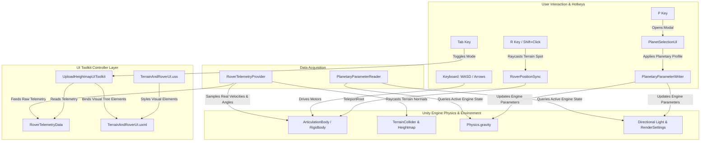

# Planetary Rover Simulation - Modern UI & Telemetry Package
**Version:** 2.0 (Unity 6 / 2022+ Compatible)  
**UI Framework:** Unity UI Toolkit (UXML + USS)  
**Visual Style:** Aerospace Cyberpunk / Dark Glassmorphism  

---

## 1. Overview

This standalone package contains the complete, upgraded user interface and physical telemetry pipeline for planetary rover simulations in Unity. It was designed to replace cluttered, opaque legacy Canvas dashboards with a state-of-the-art **Dual-Mode UI Toolkit interface**:

1. **Driving HUD Mode (Minimalist & Unobstructed):**
   - Keeps the entire 3D center viewport 100% transparent for natural driving and exploration.
   - Docks vital telemetry pods cleanly to the screen edges (Kinematics, Attitude, Heading Compass, Wheel Traction Matrix, Power, Planetary Environment).
   - Features a floating bottom action dock for instant Drive Mode switching and Camera Perspectives.
2. **Workbench & Mission Control Mode (Full Screen):**
   - High-tech interactive mission control dashboard toggled instantly with **`[Tab]`** or on-screen buttons.
   - Live procedural & NASA heightmap radar visualizer with one-click planetary presets (*Gale Crater, Olympus Mons, Shackleton Crater, Valles Marineris, Fractal*).
   - Rover fleet deployment bay (*Clearpath Husky A200, Deep Robotics M20, NASA Perseverance M2020*).
   - Real-time terrain tuning controls (Resolution, Height Scale, Relief).
3. **Interactive 1-Click Rover Placement System:**
   - Zero coordinate typing: simply click anywhere on the 3D terrain to spawn or relocate rovers.
   - Point-and-click terrain raycasting with surface normal and height alignment.

---

## 2. Directory Structure & File Catalog

```
Shared_UI_Package/
├── README.md                           <-- Technical and Integration Guide
│
├── UI_Toolkit/                         <-- Core UI Toolkit Assets
│   ├── TerrainAndRoverUI.uxml          <-- Visual Tree (XML structure for both HUD and Workbench)
│   ├── TerrainAndRoverUI.uss           <-- Cyberpunk Glassmorphism stylesheet and styling tokens
│   └── WorkbenchPanelSettings.asset    <-- UI Document PanelSettings asset (DPI scaling & match settings)
│
├── Scripts/
│   ├── Controllers/                    <-- UI Drivers & Modal Windows
│   │   ├── UploadHeightmapUIToolkit.cs <-- Master UI Toolkit Controller (binds UXML, manages HUD/Workbench)
│   │   ├── PlanetSelectionUI.cs        <-- Planetary Selection & Diff Inspector Modal Dialog
│   │   └── RoverTelemetryUI.cs         <-- Supplementary Telemetry HUD Controller & visualizer
│   │
│   ├── Data/                           <-- Physical Data Acquisition Engines
│   │   ├── RoverTelemetryData.cs       <-- High-precision data structures (Kinematics, Power, Traction)
│   │   └── RoverTelemetryProvider.cs   <-- Native Unity Physics reader (ArticulationBody & Rigidbody)
│   │
│   ├── Planetary/                      <-- Planetary Physical Environment Pipeline
│   │   ├── PlanetaryProfile.cs         <-- ScriptableObject definition for planetary physical profiles
│   │   ├── PlanetaryParameterReader.cs <-- Real-time reader querying Unity engine systems
│   │   └── PlanetaryParameterWriter.cs <-- Runtime writer applying gravity, friction, and fog
│   │
│   └── Rover_Placement/                <-- Precision Terrain Placement & Drag-and-Drop
│       ├── RoverPositionSync.cs        <-- Teleports ArticulationBody roots and synchronizes transforms
│       └── RoverPositionSyncEditor.cs  <-- Custom Scene View & Inspector 1-click terrain snap tools
│
└── Planetary_Profiles/                 <-- Ready-to-use Planetary ScriptableObject Presets
    ├── Earth.asset                     <-- 1.00g (9.81 m/s²), standard air drag, Earth sky
    ├── Mars.asset                      <-- 0.38g (3.72 m/s²), low drag, butterscotch sky, Mars regolith
    ├── Moon.asset                      <-- 0.16g (1.62 m/s²), vacuum (0 drag), stark shadows
    ├── Titan.asset                     <-- 0.14g (1.35 m/s²), dense methane atmosphere (high drag), orange fog
    └── Venus.asset                     <-- 0.90g (8.87 m/s²), super-dense atmosphere, yellow-green fog
```

---

## 3. Technical File Breakdown

### A. UI Layout & Styling (`UI_Toolkit/`)
* **`TerrainAndRoverUI.uxml`**:
  Defines the entire hierarchical layout of the interface. Contains two primary visual trees within a single root:
  - `#DrivingHUDContainer`: Edge-docked telemetry pods (`#LeftKinematicsPod`, `#AttitudePod`, `#CompassPod`, `#TractionPod`, `#BottomDockBar`).
  - `#WorkbenchOverlay`: Centered glassmorphic modal with a 3-column split (Telemetry & Environment, Heightmap Radar & Presets, Rover Deployment & Actuators).
* **`TerrainAndRoverUI.uss`**:
  Comprehensive responsive stylesheet providing:
  - Neon cyan/amber aerospace color palette (`#00E5FF`, `#00FF88`, `#FFB300`, `#FF3366`).
  - Dark glassmorphism (`rgba(8, 14, 26, 0.88)` with `backdrop-filter` borders).
  - Micro-animations, smooth hover transitions (`scale: 1.02`), and active glowing borders.
* **`WorkbenchPanelSettings.asset`**:
  Configures the UI Toolkit runtime scale mode (`Scale With Screen Size`, Reference Resolution: `1920x1080`, Match: `0.5`).

### B. UI Drivers (`Scripts/Controllers/`)
* **`UploadHeightmapUIToolkit.cs`**:
  The central script that binds C# logic to UI Toolkit elements via `UIDocument.rootVisualElement.Q<T>()`:
  - Handles the dual-mode switch between Driving HUD and Workbench (`[Tab]` hotkey).
  - Controls heightmap generation preset buttons and live radar map updates.
  - Controls rover deployment buttons (`Clearpath Husky`, `Deep Robotics M20`, `NASA Perseverance`).
  - Toggles relocation and centering modes.
* **`PlanetSelectionUI.cs`**:
  Manages the planet selection modal dialog (`[P]` key):
  - Displays list of celestial bodies with flag icons, gravity ratings, and atmospheric density.
  - Dynamically calculates a **Real-Time Physical Difference Inspector** comparing current engine settings vs. selected planet profile.
* **`RoverTelemetryUI.cs`**:
  Alternative/supplementary controller for dedicated telemetry visualization, gauges, and historical strip charts.

### C. Physical Telemetry Data Pipeline (`Scripts/Data/`)
* **`RoverTelemetryProvider.cs`**:
  Attaches directly to any Rover root GameObject. **Reads zero mock/random data**:
  - Linear velocity and acceleration directly from `ArticulationBody.velocity` or `Rigidbody.velocity`.
  - True attitude (Pitch, Roll, Yaw) relative to gravity vector.
  - Calculates true terrain slope beneath rover wheels using surface normals.
  - Measures wheel angular slip against linear ground speed to drive the 5-segment Traction Matrix.
* **`RoverTelemetryData.cs`**:
  Lightweight serializable data structures holding kinematic, attitude, slip, and power telemetry packets.

### D. Planetary Environment System (`Scripts/Planetary/`)
* **`PlanetaryProfile.cs`**:
  ScriptableObject holding the physical parameters for any celestial body:
  - Surface Gravity ($m/s^2$)
  - Terrain Static Friction, Dynamic Friction, Restitution
  - Atmospheric Rover Drag and Angular Damping
  - Atmospheric Fog (Density, Color, Mode)
  - Directional Sun Color & Intensity, Ambient Light Color & Intensity
  - WindZone Main Force & Turbulence
* **`PlanetaryParameterWriter.cs`**:
  Writes parameters directly into Unity's native systems at runtime:
  - `Physics.gravity = new Vector3(0, -gravity, 0)`
  - `TerrainCollider.sharedMaterial = new PhysicsMaterial(...)`
  - `RenderSettings.fogDensity`, `RenderSettings.ambientLight`
* **`PlanetaryParameterReader.cs`**:
  Reads currently active parameters from the running Unity engine systems without caching or hardcoded estimates.

### E. Click-to-Place Positioning (`Scripts/Rover_Placement/`)
* **`RoverPositionSync.cs`**:
  Ensures seamless drag-and-drop placement in both Edit Mode and Play Mode:
  - Synchronizes parent GameObject transform with the true `base_link` ArticulationBody root via `TeleportRoot()`.
  - Solves the common Unity issue where dragging an ArticulationBody in Scene View causes physics desync.
  - Provides `SnapToTerrainSurface()`, `CenterOnTerrain()`, `PlaceAtHighestPeak()`, and `PlaceAtLowestCrater()`.
* **`RoverPositionSyncEditor.cs`**:
  Inspector and Scene View editor tool:
  - **`Shift` + Click in Scene View**: Instantly moves the rover to the clicked terrain spot.
  - Inspector button: `[📍 CLICK ON TERRAIN TO PLACE ROVER]`.

---

## 4. Integration Guide for New Users

### Step 1: Add Files to Your Unity Project
Copy the `Shared_UI_Package` folder into your project's `Assets/` directory (e.g. `Assets/Shared_UI_Package/`).

### Step 2: Ensure Required Unity Modules are Installed
Open the Unity Package Manager (`Window` → `Package Manager`) and verify:
- **UI Toolkit** (Built-in to Unity 2021.3+ / Unity 6)
- **Input System** (Recommended) or Legacy Input Manager (Both are supported out-of-the-box)
- **TextMeshPro** (Essential Resources imported)

### Step 3: Scene Hierarchy Setup
1. Create an empty GameObject named **`UIManager`** in your active scene.
2. Add a **`UIDocument`** component to `UIManager`:
   - Set **Panel Settings** to `Shared_UI_Package/UI_Toolkit/WorkbenchPanelSettings.asset`.
   - Set **Source Asset** to `Shared_UI_Package/UI_Toolkit/TerrainAndRoverUI.uxml`.
3. Add the **`UploadHeightmapUIToolkit`** component to `UIManager`.
4. (Optional) Create an empty GameObject named **`_EnvironmentSystem`** and attach:
   - `PlanetaryParameterWriter`
   - `PlanetaryParameterReader`
   - `PlanetSelectionUI`

### Step 4: Attach Telemetry to Your Rover
1. Select your Rover GameObject (e.g., `GeneratedHusky`).
2. Attach the **`RoverTelemetryProvider`** component.
3. Attach the **`RoverPositionSync`** component.
4. Hit **Play**! The UI will automatically detect the active terrain and bind to your rover.

---

## 5. Technical Architecture & Data Flow



---

## 6. Hotkeys & Interaction Cheatsheet

| Key / Action | Function | Mode |
|---|---|---|
| **`[Tab]`** | Toggles between **Minimalist Driving HUD** and **Full Workbench** | Anywhere |
| **`[W] [A] [S] [D]`** / **Arrows** | Steers and accelerates the active rover | Driving HUD |
| **`[V]`** | Cycles camera views (Free-fly perspective / Smooth Chase Cam) | Driving HUD |
| **`[P]`** | Opens the **Planetary Environment Selection Dialog** | Anywhere |
| **`[R]`** | Enters **Interactive Relocation Mode** (hover over terrain to preview) | Driving HUD |
| **`Shift` + Left Click** | **Instant Spawn / Teleport**: Click anywhere on terrain to place rover | Anywhere |
| **`[C]`** | Instantly centers the active rover on the planetary terrain | Relocate Mode |
| **`[ESC]`** | Cancels placement / Closes open modals | Anywhere |

---

## 7. Customizing the Design System (USS Tokens)

To adapt the visual theme to match your own project's branding, open `TerrainAndRoverUI.uss` and modify the root variables at the top of the file:

```css
/* Color Palette Tokens */
--hud-accent-cyan:   #00E5FF; /* Primary readout accents and active borders */
--hud-accent-green:  #00FF88; /* Normal status, traction OK, battery full */
--hud-accent-amber:  #FFB300; /* Warning thresholds, slope alert */
--hud-accent-red:    #FF3366; /* Critical slip alert, motor over-torque */

/* Surface Backgrounds */
--hud-bg-glass:      rgba(8, 14, 26, 0.88); /* Main glassmorphic background */
--hud-bg-pod:        rgba(10, 20, 36, 0.75); /* Edge-docked telemetry pods */
--hud-border-glow:   rgba(0, 229, 255, 0.35); /* Outer glow border */
```

---

## 8. License & Attribution

This UI package was developed for the **Planetary Terrain & Rover Simulation Project**. Free to reuse, modify, and distribute for educational, research, and commercial simulation projects in Unity.
