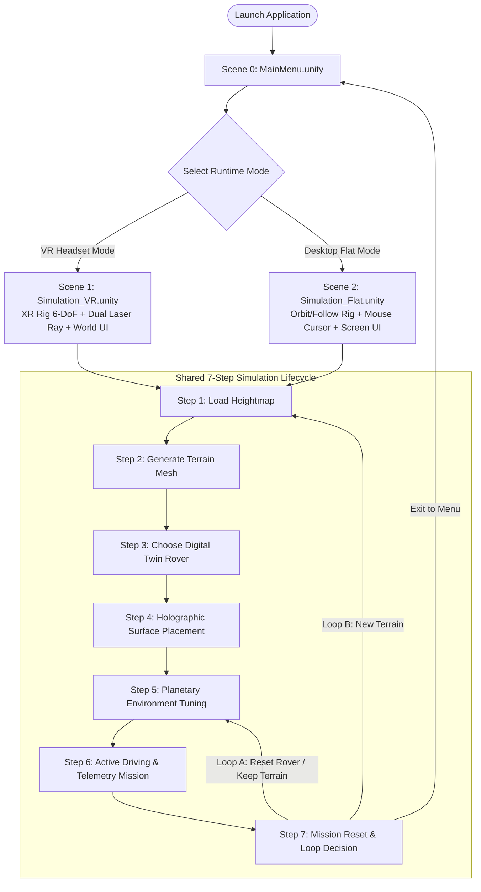
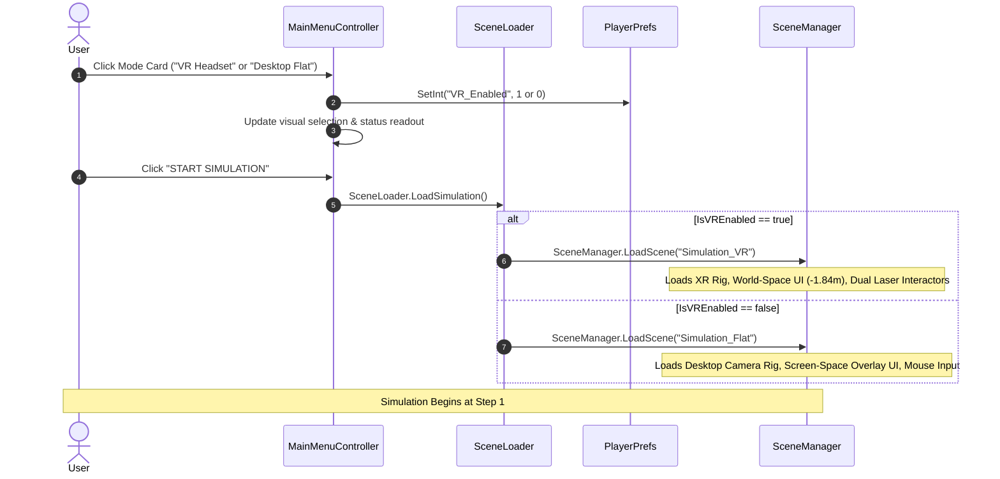
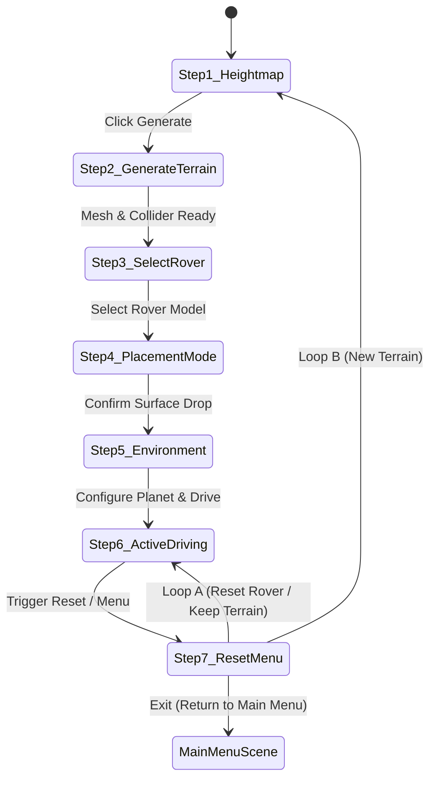

# Planetary Rover Digital Twin Simulation Studio: Complete User Flow Specification

**Project**: VR Planetary Rover Digital Twin Simulation Studio (`Final_year_07`)  
**Target Runtimes**: Meta Quest 2 / OpenXR (VR Headset Mode) & Windows PC (Desktop Flat Mode)  
**Document**: Architectural User Flow & UI State Machine Specification (`USERFLOW.md`)  
**Companion Manual**: [CONTROLS.md](file:///c:/Users/PRASAD%20BORADE/unity/Final_year_shit/CONTROLS.md)

---

## 1. Executive Summary & Flow Philosophy

The simulation architecture is decoupled into **Two Distinct Parts**:
1. **Part 1 — Startup & Scene Routing**: An isolated, lightweight start screen ([`MainMenu.unity`](file:///c:/Users/PRASAD%20BORADE/unity/Final_year_shit/Assets/project/scenes/MainMenu.unity)) where researchers/users select their target execution hardware (**VR Headset Mode** vs. **Desktop Flat Mode**) without loading heavy terrain, physics, or XR assets prematurely.
2. **Part 2 — The 7-Step Simulation Lifecycle**: Both runtime scenes ([`Simulation_VR.unity`](file:///c:/Users/PRASAD%20BORADE/unity/Final_year_shit/Assets/project/scenes/Simulation_VR.unity) and [`Simulation_Flat.unity`](file:///c:/Users/PRASAD%20BORADE/unity/Final_year_shit/Assets/project/scenes/Simulation_Flat.unity)) execute the **exact same 7 simulation steps**, identical rover physics, identical terrain generation algorithms, and identical telemetry instrumentation. Only the interaction hardware differs (Curved Laser Ray vs. Mouse Cursor, Thumbsticks vs. WASD keys).



---

## 2. Part 1: Startup & Scene Routing Architecture

### 2.1 The Main Menu (`MainMenu.unity`)
The entry-point scene (`Build Index 0`) is an aerospace-grade, high-contrast, distraction-free control console designed with Unity UI Toolkit (`MainMenu.uxml` + `MainMenu.uss`).

```
┌────────────────────────────────────────────────────────────────────────────────────────┐
│  NASA / ISRO RESEARCH TESTBED • AUTONOMOUS ROBOTICS LAB                                │
│  VR PLANETARY ROVER                                                                    │
│  DIGITAL TWIN SIMULATION STUDIO                                                        │
│  Autonomous multi-mission rover simulator for Mars, Moon, and Titan exploration        │
├────────────────────────────────────────────────────────────────────────────────────────┤
│                                                                                        │
│  SELECT RUNTIME MODE                                                                   │
│  ┌──────────────────────────────────────┐  ┌──────────────────────────────────────┐    │
│  │ [●] VR HEADSET MODE    [RECOMMENDED] │  │ [○] DESKTOP FLAT MODE     [STANDARD] │    │
│  │ Meta Quest 2 / OpenXR                │  │ Keyboard + Mouse Display             │    │
│  │ 6-DoF Immersive HMD & Dual Laser     │  │ Standard high-res monitor viewport   │    │
│  │ World-anchored mission dashboard     │  │ Screen-overlay mission dashboard     │    │
│  └──────────────────────────────────────┘  └──────────────────────────────────────┘    │
│                                                                                        │
│  [X] Launch in Virtual Reality (OpenXR)     Active Mode: VR HEADSET (Simulation_VR)    │
│                                                                                        │
├────────────────────────────────────────────────────────────────────────────────────────┤
│  SYSTEM SPECIFICATIONS                      CONTROLS OVERVIEW                          │
│  • Digital Twin: Husky, M20, Perseverance   • VR: Left Stick Drive, Curved Pointer Ray │
│  • Surface: Real HiRISE DEM Procedural Mesh • Desktop: WASD / Arrows, Mouse Look/Orbit │
│  • Physics: True ArticulationBody Solver    • Speeds: Stop (0%), Prec(25%), Cruise(100)│
├────────────────────────────────────────────────────────────────────────────────────────┤
│                                                                                        │
│                    [        START SIMULATION        ]                                  │
│                                   Exit                                                 │
└────────────────────────────────────────────────────────────────────────────────────────┘
```

### 2.2 Scene Routing Flowchart



### 2.3 Mode Routing Matrix & Fallback Guarantees
| Preference State | Target Scene | Scene Fallback | Runtime Configuration Loaded |
|---|---|---|---|
| `VR_Enabled = 1` | `Simulation_VR.unity` | `VR_Module.unity` | `XROrigin`, `Near-Far Interactors`, World-Space Canvas at $Z = -1.84\text{ m}$, 434 PPU |
| `VR_Enabled = 0` | `Simulation_Flat.unity` | `VR_Module.unity` | `DesktopFollowCamera`, `ScreenSpaceOverlay` PanelSettings, Mouse pointer, WASD |

---

## 3. Part 2: The 7-Step Shared Simulation Lifecycle

Every session advances through 7 rigorously sequenced phases. The system enforces strict state gating so invalid actions cannot be triggered out of sequence.

```
┌─────────────────────────────────────────────────────────────────────────────────────────┐
│                           7-STEP SIMULATION LIFECYCLE                                   │
│                                                                                         │
│  ┌──────────────┐     ┌──────────────┐     ┌──────────────┐     ┌──────────────┐        │
│  │ 1. Heightmap │ ──► │ 2. Terrain   │ ──► │ 3. Rover     │ ──► │ 4. Placement │        │
│  │    Selection │     │    Builder   │     │    Selection │     │    Ghost Ray │        │
│  └──────────────┘     └──────────────┘     └──────────────┘     └──────┬───────┘        │
│         ▲                                                              │                │
│         │                                                              ▼                │
│         │                                                       ┌──────────────┐        │
│         │                                                       │ 5. Planetary │        │
│         │                                                       │    Atmosphere│        │
│         │                                                       └──────┬───────┘        │
│         │                                                              │                │
│         │                                                              ▼                │
│  ┌──────┴───────┐   Loop A: Reset Rover / Keep Terrain          ┌──────────────┐        │
│  │ 7. Mission   │ ◄──────────────────────────────────────────── │ 6. Active    │        │
│  │    Reset     │ ──► Loops directly back to Step 5 / Step 6    │    Driving   │        │
│  └──────────────┘                                               └──────────────┘        │
│         │                                                                               │
│         └──► Loop B: New Terrain ──► Returns to Step 1                                  │
│         └──► Exit to Main Menu   ──► SceneLoader.LoadMainMenu()                         │
└─────────────────────────────────────────────────────────────────────────────────────────┘
```

---

## 4. Comprehensive UI State Machine Matrix

The following table details precisely what is visible, what is hidden, what controls are active, and what guidance text appears on the user's HUD across each of the 7 steps:

| Step # | Stage Name | Visual Elements SHOWN (Active / Interactive) | Visual Elements HIDDEN / MUTED | Contextual Guide Text (HUD Readout) | User Actions Required to Advance |
|:---:|:---|:---|:---|:---|:---|
| **1** | **Load Heightmap** | • Preset Buttons (Gale Crater, Olympus Mons, Shackleton, Valles Marineris, Fractal Ridge, Flat Plains)<br>• 2D Grayscale Minimap Preview<br>• Custom PNG Upload Button (File Browser)<br>• Glowing "Generate Terrain" Button<br>• Step Pill #1 Active | • Rover selection cards disabled<br>• Telemetry pods in Standby state<br>• Placement banner completely hidden<br>• Relocate / Center buttons inactive | *"STEP 1: Select a heightmap preset or upload your grayscale PNG, then click Generate Terrain."* | Click any preset or upload custom PNG, then click **Generate Terrain**. |
| **2** | **Generate Terrain** | • "Generating..." animated spinner on button<br>• Active heightmap elevation processor<br>• Real-time mesh builder & collider synchronizer<br>• Step Pill #2 Active | • All preset selectors temporarily locked<br>• Rover deploy buttons disabled<br>• 3D terrain interaction ignored | *"STEP 2: Generating 3D planetary mesh & syncing physics colliders..."* | Automated background process (takes $\approx 300\text{--}800\text{ ms}$). Auto-advances to Step 3 upon collider sync. |
| **3** | **Choose Rover** | • 3 Digital Twin Cards highlighted & pulsating:<br>&nbsp;&nbsp;1. **Clearpath Husky A200** (Skid-steer)<br>&nbsp;&nbsp;2. **Deep Robotics M20** (Quadruped)<br>&nbsp;&nbsp;3. **NASA Perseverance M2020** (Rocker-Bogie)<br>• Specification overview & payload specs<br>• Step Pill #3 Active | • Placement Mode Banner (Hidden until card clicked)<br>• Telemetry gauges in Standby<br>• Drive inputs (<kbd>WASD</kbd> / Thumbsticks) disabled | *"STEP 3: Terrain ready! Select a digital twin rover (Husky, M20, or Perseverance) to deploy."* | Click on one of the three Rover Cards using laser pointer (VR) or mouse cursor (Flat). |
| **4** | **Holographic Placement** | • Top **Placement Banner** with [CENTRE SPAWN] and [CANCEL] buttons<br>• 3D **Holographic Ghost Marker** projecting to surface:<br>&nbsp;&nbsp;• Rover footprint circle<br>&nbsp;&nbsp;• Forward heading arrow<br>&nbsp;&nbsp;• Real-time surface slope readout (🟢 Safe $\le 25^\circ$ / 🔴 Steep $>25^\circ$)<br>• Step Pill #4 Active | • 3-Column Studio Sidebars auto-collapsed for unobstructed view<br>• Rover physics frozen (`immovable = true`) to avoid falling through geometry<br>• Driving controls disabled | **VR**: *"STEP 4: Aim laser pointer at terrain & pull Trigger to place. Thumbstick to rotate heading."*<br><br>**Desktop**: *"STEP 4: Move mouse over terrain & Left-Click to place. [Q,E] or Scroll to rotate heading."* | **To Deploy**: Aim at terrain and pull Trigger (VR) or Left-Click (Flat).<br>**To Center**: Click [CENTRE SPAWN].<br>**To Cancel**: Press <kbd>B</kbd> (VR) or <kbd>Esc</kbd> (Flat). |
| **5** | **Planetary Environment** | • Glowing **Planet Badge** at top header<br>• Planetary Selection Modal with presets (Mars, Moon, Earth, Titan, Venus)<br>• Physical parameter sliders (Surface Gravity $g$, Atmospheric Density $\rho$, Ambient Temp $T$)<br>• Step Pill #5 Active | • Placement banner auto-dismissed<br>• Ghost marker destroyed | *"STEP 5: Configure planetary body & gravity (Click planet badge at top), or begin driving."* | Select target celestial body (defaults to Mars $3.72\text{ m/s}^2$). Close modal to begin driving. |
| **6** | **Active Driving & Mission Telemetry** | • Full Telemetry HUD:<br>&nbsp;&nbsp;• Linear Speed (m/s) & Ground Speed (km/h)<br>&nbsp;&nbsp;• Artificial Horizon (Pitch, Roll, Heading Compass)<br>&nbsp;&nbsp;• 6-Wheel Traction & Slip Matrix (GOOD, FAIR, SLIP, AIR)<br>&nbsp;&nbsp;• Battery, Motor Torque, Watt-hours<br>&nbsp;&nbsp;• Live Breadcrumb Radar Minimap<br>• Step Pill #6 Active | • Placement Ghost Marker destroyed<br>• Rover selection locked to active deployed unit<br>• Heightmap editing locked | **VR**: *"STEP 6: Driving active! [Left Stick] to drive • [A/X] for speeds • [B] / Recall to toggle HUD."*<br><br>**Desktop**: *"STEP 6: Driving active! [W,A,S,D] to drive • [1,2,3,4] for speeds • [Tab] for Driving HUD."* | Drive the rover across terrain. Monitor traction and telemetry. Press <kbd>Tab</kbd> (Flat) or <kbd>B</kbd> (VR) to toggle HUD modes. |
| **7** | **Mission Reset & Loops** | • Top **Workflow Banner** Reset Actions:<br>&nbsp;&nbsp;• **RESET ROVER (Keep Terrain)** Button<br>&nbsp;&nbsp;• **NEW TERRAIN** Button<br>&nbsp;&nbsp;• **MAIN MENU** Button<br>• Step Pill #7 Active | • Driving controls temporarily paused during teleport/reload<br>• Stale telemetry readings wiped | *"STEP 7: Reset options active. Click 'RESET ROVER' to respawn, or 'NEW TERRAIN' to start over."* | Choose one of three paths:<br>1. Reset Rover (Loop A)<br>2. New Terrain (Loop B)<br>3. Return to Main Menu. |

---

## 5. Reset Loops & Branching Flow Architecture

The user can iterate through simulations rapidly without restarting the application:



### Loop A: Reset Rover (Keep Terrain)
- **Use Case**: Rover tumbled down a crater, got stuck between boulders, or user wants to restart mission timer on the same landscape.
- **System Action**:
  1. Preserves generated terrain mesh and material.
  2. Teleports active rover back to its original placement coordinate (or terrain center).
  3. Resets ArticulationBody velocities to zero (`linearVelocity = 0`, `angularVelocity = 0`).
  4. Resets mission odometer, elapsed mission timer, and traction slip logs.
  5. Transitions directly to **Step 6 (Active Driving)**.

### Loop B: New Terrain
- **Use Case**: Researcher wants to test the rover on a different planetary topography (e.g., switching from Mars Gale Crater to Lunar Shackleton Rim).
- **System Action**:
  1. Gracefully disables and destroys active rover instance via [`ActiveRoverContext.DestroyActiveRover()`](file:///c:/Users/PRASAD%20BORADE/unity/Final_year_shit/Assets/project/script/Rover/ActiveRoverContext.cs).
  2. Clears previous telemetry data.
  3. Switches UI back from Driving HUD to Full Studio Mode.
  4. Returns UI to **Step 1 (Load Heightmap)** with preset buttons reactivated.

### Loop C: Return to Main Menu
- **Use Case**: Switch from Desktop mode to VR mode (or vice-versa), or exit application.
- **System Action**:
  1. Calls [`SceneLoader.LoadMainMenu()`](file:///c:/Users/PRASAD%20BORADE/unity/Final_year_shit/Assets/project/script/Core/SceneLoader.cs).
  2. Safely unloads simulation scene and loads [`MainMenu.unity`](file:///c:/Users/PRASAD%20BORADE/unity/Final_year_shit/Assets/project/scenes/MainMenu.unity).

---

## 6. Hardware Input Mapping: VR vs Desktop Comparison

| Action / Capability | 🥽 Virtual Reality (`Simulation_VR`) | 🖥️ Desktop Flat Mode (`Simulation_Flat`) |
|---|---|---|
| **UI Interaction** | Curved Laser Pointer Ray (Right or Left hand Near-Far Interactor) | Hardware Mouse Pointer with Raycast Cursor |
| **UI Click / Select** | Index Trigger click (`XRI Select`) | Left Mouse Button (<kbd>LMB</kbd>) |
| **Rover Placement Aim** | Laser Ray projected onto terrain ($100\text{ m}$ range) | Mouse Cursor cast from Camera onto terrain |
| **Placement Heading Yaw** | Left/Right Thumbstick horizontal axis ($\pm X$) | <kbd>Q</kbd> / <kbd>E</kbd> keys or Mouse Scroll Wheel |
| **Confirm Placement** | Pull Index Trigger on valid terrain | Left-Click (<kbd>LMB</kbd>) on valid terrain |
| **Cancel Placement** | Secondary Button <kbd>B</kbd> (Right Controller) | <kbd>Esc</kbd> key or Right-Click (<kbd>RMB</kbd>) |
| **Primary Drive Throttle** | Left Thumbstick vertical axis ($\pm Y$) | <kbd>W</kbd> / <kbd>S</kbd> or <kbd>↑</kbd> / <kbd>↓</kbd> (Analog Ramp) |
| **Primary Steer** | Left Thumbstick horizontal axis ($\pm X$) | <kbd>A</kbd> / <kbd>D</kbd> or <kbd>←</kbd> / <kbd>→</kbd> (Analog Ramp) |
| **Speed Regimes** | Button <kbd>A</kbd> or <kbd>X</kbd> (Cycles Stop ➔ Precision ➔ Explore ➔ Cruise) | Number keys <kbd>1</kbd> (Stop), <kbd>2</kbd> (Precision), <kbd>3</kbd> (Explore), <kbd>4</kbd> (Cruise) |
| **M20 Knee Articulation** | *N/A (Mapped to controller preset)* | Hold <kbd>Q</kbd> (Raise knees) / Hold <kbd>E</kbd> (Lower knees) |
| **M2020 Steering Mode** | *N/A (Mapped to controller preset)* | <kbd>M</kbd> key (Ackermann ➔ Point Turn ➔ Crab ➔ Tank) |
| **M2020 Rocker-Bogie Lift**| *N/A (Mapped to controller preset)* | <kbd>Space</kbd> key (Toggles $+8^\circ$ ground clearance) |
| **Camera Perspective** | 6-DoF Room-scale Head Movement (1:1 Natural Gaze) | <kbd>V</kbd> key (Rear, Left, Front, Right, Top) + Orbit Drag |
| **Toggle HUD View** | Button <kbd>B</kbd> (Dynamic Gaze Recall at $Z = -1.84\text{ m}$) | <kbd>Tab</kbd> (Toggles 3-Column Studio vs Minimal Driving HUD) |
| **Respawn Shortcut** | Press Reset in UI or Trigger Recenter | <kbd>R</kbd> key (Instant respawn at last safe coordinate) |

---

## 7. Dual-Scene Architectural Symmetry & Drift Prevention

To prevent `Simulation_VR` and `Simulation_Flat` from drifting apart during development, the project strictly adheres to **Prefab Component Architecture**:

```
                       SHARED ARCHITECTURAL PREFABS
                       ┌───────────────────────────┐
                       │  TerrainGenerator.prefab  │
                       │  SimulationFlow.prefab    │
                       │  RoverSpawners.prefab     │
                       │  EnvironmentSystem.prefab │
                       │  TelemetryHub.prefab      │
                       └─────────────┬─────────────┘
                                     │
           ┌─────────────────────────┴─────────────────────────┐
           ▼                                                   ▼
┌─────────────────────────────┐             ┌─────────────────────────────┐
│    Simulation_VR.unity      │             │    Simulation_Flat.unity    │
│  • XR Origin Rig (Floor)    │             │  • Desktop Camera Rig       │
│  • Near-Far Interactors     │             │  • Mouse Pointer System     │
│  • World-Space UIDocument   │             │  • ScreenSpace UIDocument   │
│    (Z = -1.84m, 434 PPU)    │             │    (ScreenSpaceOverlay)     │
│  • VRUIPositioner Enabled   │             │  • VRUIPositioner Disabled  │
└─────────────────────────────┘             └─────────────────────────────┘
```

### Key Safety Guarantees:
1. **Zero Physics Duplication**: Both scenes reference the identical ArticulationBody solver parameters, physics materials, and rover kinematic scripts.
2. **Unified UI Controller**: Both scenes run [`UploadHeightmapUIToolkit.cs`](file:///c:/Users/PRASAD%20BORADE/unity/Final_year_shit/Assets/Shared_UI_Package/Scripts/Controllers/UploadHeightmapUIToolkit.cs). At startup, the controller inspects [`SceneLoader.IsVREnabled`](file:///c:/Users/PRASAD%20BORADE/unity/Final_year_shit/Assets/project/script/Core/SceneLoader.cs) and automatically adapts:
   - In **Flat Mode**: Disables `VRUIPositioner`, strips VR world colliders, attaches `ScreenSpaceOverlay` panel settings, and shows keyboard prompts.
   - In **VR Mode**: Activates `VRUIPositioner`, anchors the panel at $Z = -1.84\text{ m}$, adjusts PPU to 434 for crystal-clear retina rendering, and shows XR controller prompts.
3. **No Drift on New Features**: Any new rover feature, terrain filter, or telemetry gauge added to UI Toolkit or rover scripts immediately functions identically in both VR and Flat modes.

---

## 8. Verification & QA Testing Checklist

Use this checklist during academic evaluations, testing sessions, and user demonstrations:

### ✅ Part 1: Main Menu & Startup Routing
- [ ] **Test 1.1**: Open `MainMenu.unity` and enter Play Mode.
- [ ] **Test 1.2**: Verify NASA/ISRO header, clean dark navy theme, and crisp typography.
- [ ] **Test 1.3**: Click "DESKTOP FLAT MODE". Confirm card highlights with cyan border, checkbox unchecks, and status reads `DESKTOP FLAT (Simulation_Flat)`.
- [ ] **Test 1.4**: Click "VR HEADSET MODE". Confirm card highlights, checkbox checks, and status reads `VR HEADSET (Simulation_VR)`.
- [ ] **Test 1.5**: Click "START SIMULATION" with Flat Mode selected. Confirm `Simulation_Flat.unity` loads instantly without errors.

### ✅ Part 2: Step-by-Step Simulation Flow (Steps 1–7)
- [ ] **Step 1 (Heightmap)**:
  - [ ] Preset buttons (Gale, Olympus, Shackleton, etc.) are visible and selectable.
  - [ ] Banner guide text displays: *"STEP 1: Select a heightmap preset or upload your grayscale PNG..."*
  - [ ] Click "Gale Crater". Verify 2D preview updates.
- [ ] **Step 2 (Terrain Generation)**:
  - [ ] Click "Generate Terrain".
  - [ ] Banner updates to: *"STEP 2: Generating 3D planetary mesh..."*
  - [ ] Terrain elevations appear in 3D viewport and physics collider binds within 1 second.
- [ ] **Step 3 (Rover Selection)**:
  - [ ] Banner updates to: *"STEP 3: Terrain ready! Select a digital twin rover..."*
  - [ ] Husky, M20, and Perseverance cards pulse with ready state.
  - [ ] Click **NASA Perseverance (M2020)**.
- [ ] **Step 4 (Surface Placement)**:
  - [ ] Placement Banner appears with [CENTRE SPAWN] and [CANCEL].
  - [ ] Holographic ghost ring with arrow and slope readout projects onto terrain under cursor/ray.
  - [ ] Safe slopes display green degrees; steep cliffs display red.
  - [ ] Rotate heading with <kbd>Q</kbd>/<kbd>E</kbd> or Thumbstick.
  - [ ] Left-Click (or pull Trigger) on terrain. Rover drops smoothly onto surface without sinking or bouncing.
- [ ] **Step 5 (Planetary Environment)**:
  - [ ] Banner guides to planetary environment setup.
  - [ ] Click Planet badge at top. Verify Mars, Moon, Titan, etc., change surface gravity accordingly.
- [ ] **Step 6 (Active Driving & Telemetry)**:
  - [ ] Drive with <kbd>W,A,S,D</kbd> (Desktop) or Left Thumbstick (VR).
  - [ ] Speedometer, G-force, attitude artificial horizon, and wheel slip cells update in real time.
  - [ ] Press <kbd>Tab</kbd> (Desktop) or <kbd>B</kbd> (VR). Verify Driving HUD Mode leaves viewport crystal clear.
  - [ ] Press <kbd>M</kbd> to cycle Perseverance steering (Ackermann ➔ Point Turn ➔ Crab ➔ Tank).
- [ ] **Step 7 (Mission Reset & Loops)**:
  - [ ] Click **RESET ROVER (Keep Terrain)**: Rover respawns at placement origin; terrain and environment preserved.
  - [ ] Click **NEW TERRAIN**: Rover is destroyed; UI returns to Step 1 for fresh heightmap generation.
  - [ ] Click **MAIN MENU**: Simulation unloads cleanly and returns to `MainMenu.unity`.
